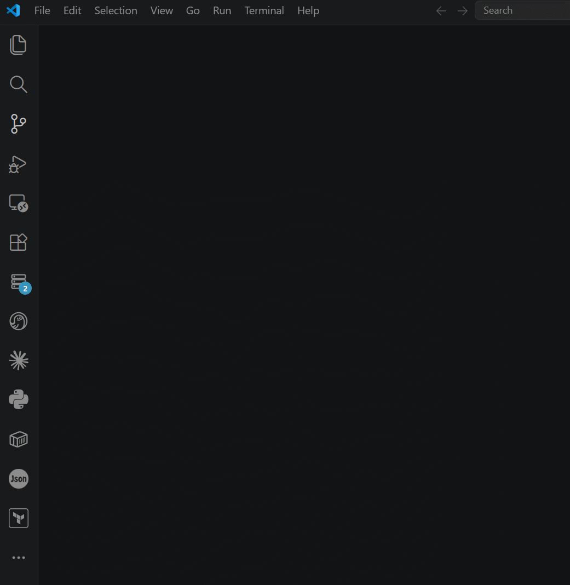
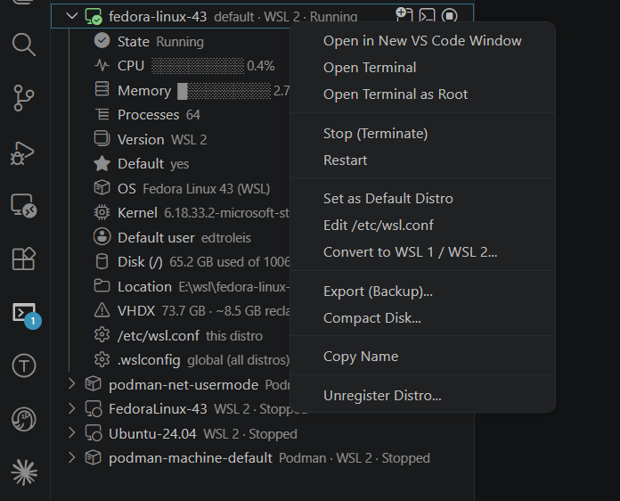
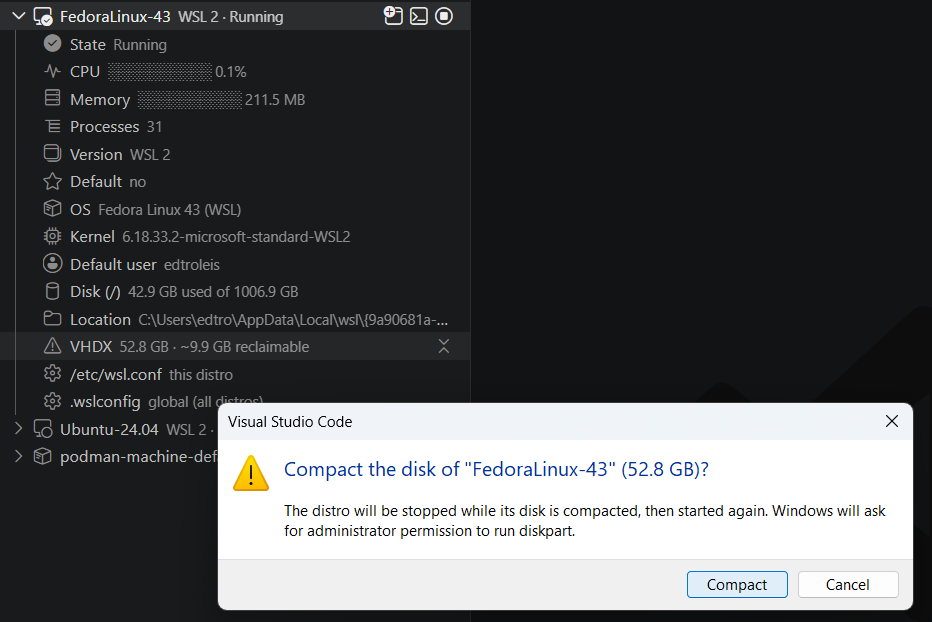
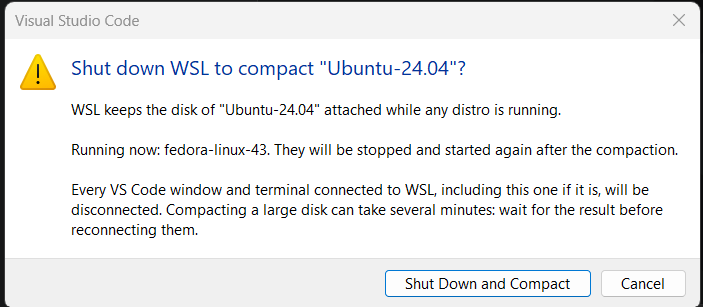

# Distro Manager for WSL

[](https://code.visualstudio.com/)
[](https://marketplace.visualstudio.com/items?itemName=edtroleis.vscode-wsl-distro-manager)
[](https://marketplace.visualstudio.com/items?itemName=edtroleis.vscode-wsl-distro-manager)
[](https://learn.microsoft.com/windows/wsl/)
[](https://github.com/edtroleis/vscode-wsl-distro-manager/actions/workflows/release.yml)
[](LICENSE)

Keep your WSL distros healthy from the VS Code sidebar. See what each distro
uses right now, give unused disk space back to Windows, back up the folders
that matter, and start, stop, install, or move distros without breaking the
tools and windows that depend on them.



Distro Manager for WSL complements Microsoft's **WSL** extension
([`ms-vscode-remote.remote-wsl`](https://marketplace.visualstudio.com/items?itemName=ms-vscode-remote.remote-wsl)),
which connects VS Code to a distro. This extension looks after the distros
themselves.

> Distro Manager for WSL is a community project. It is not affiliated with,
> endorsed by, or supported by Microsoft. Windows, Windows Subsystem for Linux,
> WSL, and Visual Studio Code are trademarks of Microsoft Corporation.

**Contents:** [Features](#features) · [Requirements](#requirements) ·
[Getting started](#getting-started) · [Guides](#guides) ·
[Commands](#commands) · [Settings](#settings) ·
[Known limitations](#known-limitations) · [Troubleshooting](#troubleshooting) ·
[Security](#security) · [Privacy](#privacy) · [Support](#support)

## Features

**Watch every distro**
- Live CPU, memory, and process count for running distros, next to the totals
  of the WSL VM, shared by every VS Code window.
- State, WSL version, and default distro, refreshed automatically.
- Expand a distro for its OS, kernel, default user, disk usage, install
  location, and virtual disk (VHDX) size.


**Reclaim disk space**
- See how much space a distro's virtual disk holds beyond what it uses, and
  compact it to give that space back to Windows. The estimate appears only
  when compaction is worth it.

**Back up what matters**
- Back up chosen folders to a `.tar.gz` or `.zip` on your Windows Desktop,
  without exporting the whole distro.
- Send Windows files into a distro, and restore backups in place.
- Export and import whole distros (`.tar` or `.vhdx`), with progress and
  cancel.

**Stay safe**
- Compacting and moving never shut WSL down while VS Code windows are
  connected to it; *Restart WSL* and *Shut Down WSL* name the windows that will
  disconnect before you confirm.
- Distros owned by Docker Desktop, Podman, or Rancher Desktop are labeled and
  protected.
- Nothing runs as root without you: the only privileged step inside a distro,
  repairing Windows interop, goes through its `sudo` after you agree (see
  [Security](#security)).
- Lost Windows interop ("Exec format error" after another distro stops) is
  detected, and repaired with your consent.
- Backups that include credentials (`.ssh`, `.aws`, ...) ask first.
- Destructive actions ask first; unregistering requires typing the distro name.

**Control and organize**
- Start, stop, and restart. A started distro stays running until you stop it;
  WSL would otherwise stop it about 15 seconds later.
- Open a terminal, or a new VS Code window connected to the distro.
- Install distros from the official online catalog, with the name and location
  you choose, and move a distro's disk to another folder or drive.
- Set the default distro, restart WSL, or shut it down. *Restart WSL* starts
  again only the distros that were running.
- Edit the global `.wslconfig` from its row under the **WSL** node, at the top
  of the view; hover it to see the main settings. The node also shows the WSL
  and kernel versions. See [Configure WSL](#configure-wsl-wslconfig).

Every action is one right-click away:



## Requirements

- Windows 10 or 11 with WSL installed. Tested with WSL 2.7.
- VS Code 1.85 or later.
- *Install Distro* and *Move to Another Folder* need a recent WSL. Run
  `wsl --update` if they fail.
- *Open in New VS Code Window* needs Microsoft's WSL extension.

## Getting started

1. Install **Distro Manager for WSL** from the Marketplace.
2. Click the **Distro Manager for WSL** icon in the activity bar.
3. Click a distro to expand it. Right-click it for every action, or use the
   buttons on its row. The **WSL** node at the top holds what applies to all
   distros: the global `.wslconfig` and the WSL version.

The view's title bar has **Refresh**, **Extension Settings** (the gear), and
**Shut Down WSL**; its `...` menu has *Install Distro*, *Import Distro*,
*Repair Windows Interop*, and *About*.

Every action is also in the Command Palette (`Ctrl+Shift+P`), under
**Distro Manager for WSL**.

## Guides

### Reclaim disk space

A WSL 2 distro stores its files in a virtual disk (VHDX) that grows but never
shrinks on its own: space freed inside the distro stays allocated on your
Windows drive. When a running distro is expanded, its **VHDX** row shows the
space a compaction would give back, next to a **Compact Disk** button.



The estimate appears only when compaction is worth it: at least 2 GB and 10% of
the space in use. A virtual disk always holds some file system overhead, so a
smaller gap gives back almost nothing. The confirmation repeats the expected
gain, or warns when there is little to reclaim.

Compaction stops the distro, asks Windows for administrator permission (UAC) to
run `diskpart`, then starts the distro again. Current WSL versions keep every
distro's disk attached while *any* distro is running. In that case the
extension asks to shut WSL down, lists the running distros, and starts them
again afterwards.



A shutdown disconnects every VS Code window connected to WSL, and those windows
do not always reconnect. **Compaction therefore refuses to run while a VS Code
window is connected to WSL.** It changes nothing and names the windows to
close. Close them, then run *Compact Disk* from a local VS Code window. A 50 GB
disk takes a few minutes; the notification shows the elapsed time.


### Back up folders and restore them

**Back Up Folders...** archives the folders and files you choose, without
exporting the whole distro:

1. Choose what to include, starting in your home folder:
   - Check a folder to take all of it, without opening it.
   - Click its **➔** to open it and choose the folders and files inside. There,
     *Everything in ...* takes the whole folder again, and *Back to ...* (or
     **←** in the title) returns to the folder above.
   - Choose *Type paths...* to enter paths relative to your home, or absolute.

   Choices in every folder are kept until you click **OK**.
2. Choose the format. `.tar.gz` is recommended: it keeps Linux permissions and
   symbolic links. `.zip` opens anywhere but loses them, so restored scripts are
   no longer executable.
3. Review the names to leave out. `node_modules`, `.venv`, `venv`,
   `__pycache__`, `.cache`, and `target` are excluded by default.
4. Choose where to save it: your Windows **Desktop** (also when it is redirected
   to OneDrive), the folder in `wslManager.backupFolder`, or any other folder.

The backup runs inside the distro as your user. Files you cannot read are left
out, and the result tells you so. The archive is not encrypted: if it includes
folders that usually hold credentials (`.ssh`, `.aws`, `.kube`, `.gnupg`, ...),
the extension asks first, and says when the destination is synced to the
cloud.

To restore, use **Send Files to Distro...**, send the archive to the folder it
came from (usually `~`), and choose **Send and extract**.

### Send files into a distro

**Send Files to Distro...** copies files from Windows into a folder of the
distro, `~` by default. It runs as your user and never uses `sudo`: if the
folder needs more permissions, it says so and changes nothing. Before copying,
it asks whether to overwrite or skip files that already exist, and whether to
extract `.tar.gz` or `.zip` archives. Extract only archives you trust.

### Install, move, export, and import

- **Install Distro...** lists the online catalog. After installing, open a
  terminal in the new distro to create its default user.
- **Move to Another Folder...** moves the distro's virtual disk, for example to
  another drive. Like compaction, it needs the disk released, so the same rules
  about shutting WSL down apply.
- **Export** and **Import** show progress and can be cancelled. A cancelled
  export deletes its partial file, and a cancelled import leaves nothing
  behind.

### Configure WSL (.wslconfig)

`%USERPROFILE%\.wslconfig` holds the settings of the WSL VM that every distro
shares, such as `memory` and `processors`. Click the *.wslconfig* row under
the **WSL** node to edit it; when the file does not exist yet, it opens with a
commented template.

The file applies only when WSL restarts, not Windows. On save, the extension
offers **Restart WSL Now**, which stops WSL and starts again the distros that
were running, and the row shows *restart WSL to apply* until the change is in
effect.

Per-distro files such as `/etc/wsl.conf` belong to the distro and need `sudo`;
edit them inside the distro.

### Distros managed by other tools

Distros created by **Docker Desktop** (`docker-desktop`, `docker-desktop-data`),
**Podman** (`podman-*`), and **Rancher Desktop** show the tool's name.
Configuration actions are hidden for them, and stopping or unregistering one
warns first, because doing it from here can break that tool. Set
`wslManager.showManagedDistros` to `false` to hide them.

## Commands

All commands are in the Command Palette under **Distro Manager for WSL**.

| Command | Where | What it does |
|---|---|---|
| Start, Stop | Distro row, context menu | Start keeps the distro running until you stop it. |
| Restart | Context menu | Stops and starts the distro. |
| Open Terminal, Open in New VS Code Window | Distro row, context menu | New window needs Microsoft's WSL extension. |
| Set as Default Distro | Context menu | Same as `wsl --set-default`. |
| Export (Backup)... | Context menu | The whole distro as `.tar` or `.vhdx`, with progress and cancel. |
| Import Distro... | `...` menu | From a `.tar` or `.vhdx`, under the name and folder you choose. |
| Install Distro... | `...` menu | From the official online catalog. |
| Compact Disk..., Move to Another Folder... | Context menu, VHDX row | Need the disk released; see [Reclaim disk space](#reclaim-disk-space). |
| Back Up Folders..., Send Files to Distro... | Context menu | Run as your user; see the [guide](#back-up-folders-and-restore-them). |
| Unregister Distro... | Context menu | Deletes the distro and its disk; asks you to type its name. |
| Copy Name | Context menu | Copies the distro name. |
| Edit .wslconfig (Global), Restart WSL | WSL node | See [Configure WSL](#configure-wsl-wslconfig). |
| Shut Down WSL | Title bar, WSL node | `wsl --shutdown`, after naming the windows it disconnects. |
| Repair Windows Interop | `...` menu | Through `sudo`, after you agree. |
| Refresh, Extension Settings, About | Title bar, `...` menu | About shows the version and links to the changelog and issues. |

## Settings

Open them with the gear in the view's title bar, or search for
`wslManager` in **Settings**.

| Setting | Default | Description |
|---|---|---|
| `wslManager.clickAction` | `expand` | What clicking a distro does: `expand`, `terminal`, `window`, or `none`. |
| `wslManager.autoRefreshSeconds` | `10` | Refresh interval while the view is visible. `0` turns it off. |
| `wslManager.metricsIntervalSeconds` | `2` | CPU and memory sampling interval for an expanded distro. |
| `wslManager.showManagedDistros` | `true` | Show Docker Desktop, Podman, and Rancher Desktop distros. |
| `wslManager.backupFolder` | *(empty)* | Folder offered first for backups. Empty means the Windows Desktop. |
| `wslManager.backupExcludes` | `node_modules`, `.venv`, ... | Names left out of backups, at any depth. |
| `wslManager.defaultUser` | *(empty)* | User for new terminals. Empty means the distro's default user. |
| `wslManager.confirmDestructiveActions` | `true` | Confirm before stopping, shutting down, or unregistering. |
| `wslManager.wslExePath` | *(empty)* | Path to `wsl.exe`. Empty means detect it automatically. |

## Known limitations

- **Compacting or moving a disk needs WSL shut down** on current WSL versions,
  which closes every WSL terminal. The extension refuses while VS Code windows
  are connected to WSL rather than disconnect them.
- **Memory is an estimate.** It adds up the memory of each process, so memory
  shared between processes counts more than once, and a distro can show more
  than the whole VM uses. Measuring it exactly would need root.
- **Started distros keep running** until you stop them, even after VS Code
  closes. This is what *Start* is for, but it keeps the WSL VM using memory.
- **Live metrics keep an expanded distro running.** Collapse it, or hide the
  view, to let WSL stop it.

## Troubleshooting

**`.exe` files stop working inside a distro ("Exec format error").**
When a distro stops, WSL removes Windows interop from every other running
distro. The extension notices and offers to repair it; you can also run
**Repair Windows Interop** from the view's `...` menu. The repair uses the
distro's `sudo`, asking for your password if the distro requires one. By hand,
from inside the distro:

```bash
sudo sh -c "echo :WSLInterop:M::MZ::/init:P > /proc/sys/fs/binfmt_misc/register"
```

**A `.wslconfig` change has no effect.** It applies only when the WSL VM
restarts, not Windows. Run **Restart WSL** from the **WSL** node; the
*.wslconfig* row shows *restart WSL to apply* until the change is in
effect.

**A VS Code window connected to WSL shows "Failed to connect to the remote
extension host server".** WSL was shut down, for example by *Shut Down WSL*.
Run **Developer: Reload Window** in that window.

**Installing a downloaded `.vsix` fails with "UNC host 'wsl.localhost' access
is not allowed".** VS Code on Windows does not open files inside a distro.
Copy the `.vsix` to a Windows folder first.

**The view shows an error.** Check that `wsl.exe --list` works in a terminal.
If `wsl.exe` is not on the `PATH`, set `wslManager.wslExePath`. With no distro
installed, the view offers *Install Distro* and *Import Distro* instead.

## Security

- **No root without your consent.** WSL lets your Windows account enter any
  distro as root with no password (`wsl -u root`), bypassing the distro's
  `sudo` rules. The extension never uses that. Its only privileged step inside
  a distro, repairing Windows interop, asks first, shows the exact command, and
  runs it through the distro's `sudo`, so the distro decides who may do it and
  whether a password is needed. A password you type goes to `sudo` on standard
  input only; it is never stored or logged.
- **Administrator rights only through UAC.** Compacting a disk runs `diskpart`,
  which Windows allows only after its UAC prompt. The `diskpart` commands are
  passed inside the elevated process's own command line, not through a file
  another program could change before it runs.
- **Your files, as your user.** Details, live metrics, backups, and sending
  files run as the distro's default user. Folders that would need `sudo` are
  refused, not escalated.
- **No distro system files are edited.** Files such as `/etc/wsl.conf` are left
  to `sudo` inside the distro. The only configuration file the extension writes
  is your Windows `%USERPROFILE%\.wslconfig`.
- **Programs by absolute path.** Windows programs (`wsl.exe`, `reg.exe`,
  PowerShell, `diskpart`) are started from `System32` by full path, never looked
  up by name, so a same-named program elsewhere cannot run in their place.
- **No shell injection.** Commands are started with explicit argument lists;
  names and paths are passed as arguments, never pasted into a shell script.
- **Backups warn about credentials.** A backup is an unencrypted archive. When
  it includes folders that usually hold credentials (`.ssh`, `.aws`, `.kube`,
  `.gnupg`, ...), the extension asks first, and says so when the destination is
  synced to the cloud (for example a Desktop in OneDrive). Extract only
  archives you trust.
- **Workspaces cannot change what runs.** The settings that choose a program
  (`wslExePath`), a user (`defaultUser`), a destination (`backupFolder`), or
  whether to confirm (`confirmDestructiveActions`) apply only from your user
  settings; a project's `.vscode/settings.json` cannot set them. The extension
  reads and runs nothing else from the workspace, so it stays available in
  Restricted Mode.
- **Release pipeline.** CI runs with a read-only token; the release job alone
  can write, and GitHub Actions are pinned to commit hashes.

Report security issues privately, as described in [SECURITY.md](SECURITY.md).

## Privacy

The extension collects no telemetry and makes no network requests. Installing
a distro and listing the catalog go through `wsl.exe`, which downloads from
Microsoft. Live metrics are shared between VS Code windows through files in
`%TEMP%\wsl-distro-manager`.

## Support

- **Questions and bugs:** [open an issue](https://github.com/edtroleis/vscode-wsl-distro-manager/issues/new/choose).
  The form asks for the extension, WSL, and Windows versions, and the log.
- **Version:** run **About** from the view's `...` menu.
- **Log:** open **View > Output** and choose *Distro Manager for WSL*. It
  starts with the extension's version and lists what the extension did (for
  example each click in the backup list), never passwords or file contents.
- **Security issues:** report them privately; see [SECURITY.md](SECURITY.md).
- **Changes:** see the [changelog](CHANGELOG.md).

## Languages

English and Brazilian Portuguese. The extension follows the VS Code display
language (**Configure Display Language**).

## Contributing

Bug reports, ideas, and pull requests are welcome. See
[CONTRIBUTING.md](CONTRIBUTING.md) for the development setup, and
[docs/ARCHITECTURE.md](docs/ARCHITECTURE.md) for how the extension works
around WSL's quirks.

## License

[MIT](LICENSE)
