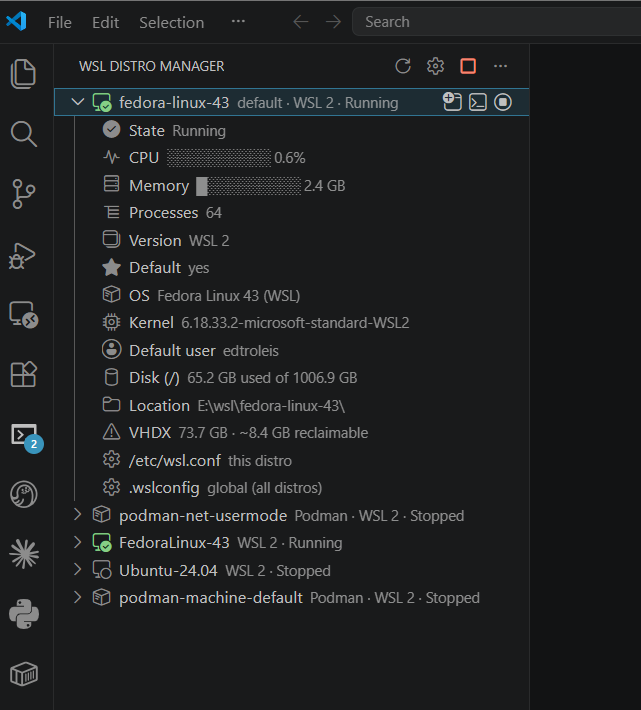

# WSL Distro Manager

Manage your WSL distros from the VS Code sidebar: lifecycle, live CPU and
memory, default distro, backups, and editing of the configuration files.

It does not replace the official **WSL** extension (`ms-vscode-remote.remote-wsl`),
which is still what connects VS Code to a distro. This one covers what the
official extension does not: start/stop, `--set-default`, export/import,
`--shutdown`, resource monitoring, and editing `.wslconfig` and `/etc/wsl.conf`.



## Features

| Action | WSL command behind it |
|---|---|
| List distros with state, version, and default | `wsl -l -q`, `wsl -l --running -q`, `wsl -l -v` |
| Details on expand: OS, kernel, user, disk, location, VHDX size | registry `HKCU\...\Lxss`; `wsl -d <d> -e sh` only if the distro is already running |
| Live CPU, memory, and process count (expanded, running distro) | `sh` loop over `/proc` via `wsl -d <d> -e` |
| Compact the VHDX to reclaim disk space | `fstrim`, `wsl --terminate`, then `diskpart compact vdisk` (UAC prompt) |
| Start / Stop / Restart | `wsl -d <d> -e /bin/true` + a hidden idle session, `wsl --terminate <d>` |
| Set default distro | `wsl --set-default <d>` |
| Convert WSL 1 ⇄ WSL 2 | `wsl --set-version <d> <n>` |
| Install a distro from the online catalog | `wsl --list --online`, `wsl --install <d> --name <n> [--location <dir>] --no-launch` |
| Export / Import (`.tar` or `.vhdx`), with progress and cancel | `wsl --export` / `wsl --import` |
| Move a distro's disk to another folder or drive | `wsl --manage <d> --move <dir>` |
| Back up chosen folders to a `.tar.gz` / `.zip` on Windows | `tar` / `zip` inside the distro, as your user |
| Send Windows files into the distro, and restore backups there | `cp`, `tar -x` / `unzip` inside the distro, as your user |
| Unregister a distro | `wsl --unregister <d>` |
| Shut down WSL | `wsl --shutdown` |
| Open a terminal | `wsl -d <d> [-u <user>]` |
| Open a new connected window | authority `wsl+<d>` |
| Edit the distro's `/etc/wsl.conf` | `wsl -d <d> -u root` |
| Edit the global `.wslconfig` | `%USERPROFILE%\.wslconfig` |

Every action is also in the distro's context menu:


Long operations (export, import, move, install) show progress and can be
cancelled. Cancelling ends the whole `wsl.exe` process tree, which really stops
the work in the WSL service: an export stops writing and its partial file is
deleted, and a cancelled import leaves nothing registered. Moving a distro, like
compacting it, needs its disk released, which current WSL only does when the
whole VM shuts down; the same rules apply (see below).

Destructive actions (stop, shut down, convert) ask for confirmation;
`unregister` requires typing the distro name. Actions that would disconnect the
current VS Code window always ask, even with confirmations turned off.

### Reclaiming disk space

A WSL 2 distro keeps its files in a VHDX that grows but never shrinks on its own:
space freed inside the distro stays allocated on the Windows drive. When a
running distro is expanded, the **VHDX** row shows how much a compaction would
give back, with an inline **Compact Disk** button. The estimate only appears when
the gap between the file and the used space is at least 2 GB and 10% of the used
space: the VHDX always holds some file system overhead beyond what `df` reports,
so smaller gaps reclaim almost nothing (in testing, a 1.2 GB gap gave back 23 MB).
The confirmation repeats the estimate, or warns when there is little to gain.

Compacting stops the distro, asks Windows for administrator permission (UAC) to
run `diskpart`, and starts the distro again if it was running.


Current WSL versions keep **every** distro's disk attached to the WSL VM while
any distro is running, even disks of distros that have stopped. When that is the
case, the extension lists the running distros and asks to shut WSL down; after
compacting, it starts them again (except Docker/Podman/Rancher distros, which
must be started from their tool).


A shutdown would disconnect every VS Code window connected to WSL, and those
windows do not reliably reconnect afterwards. So when any VS Code window is
connected to WSL (detected through the `wsl.exe` processes running the VS Code
server), compaction **refuses to shut WSL down**, changes nothing, and names the
windows to close. Close them and run *Compact Disk* from a local VS Code window;
WSL terminals are closed by the shutdown. `diskpart` reports no progress, and a
50 GB disk takes a few minutes `diskpart` reports no progress, and a 50 GB disk takes a few minutes
(the notification shows the elapsed time).


### Backups and sending files

**Back Up Folders...** archives folders and files of your choice from the distro
into one file on Windows, without exporting the whole distro. Pick entries of
your home folder from a list, or type paths (relative to home, or absolute). The
file goes to your Windows **Desktop** by default, found through Windows, so a
Desktop redirected to OneDrive works too; `wslManager.backupFolder` or
*Choose a folder...* picks another place. Folders such as `node_modules`,
`.venv`, and `target` are left out by default (`wslManager.backupExcludes`,
editable each time).

`.tar.gz` is the default because it keeps Linux permissions and symlinks;
`.zip` opens anywhere but loses them, so scripts stop being executable after a
restore. The archiver runs inside the distro as your user: files you cannot
read are left out, and the result says so. Absolute paths are stored without the
leading `/`.

**Send Files to Distro...** copies Windows files into a folder of the distro
(`~` by default). It runs as your user and never uses `sudo`: if the folder needs
more permissions, it says so and changes nothing. It asks before overwriting,
and when you send a `.tar.gz` / `.zip` it offers to extract it there, which
restores a backup in place.

### Distros managed by other tools

Distros created by **Docker Desktop** (`docker-desktop`, `docker-desktop-data`),
**Podman** (`podman-*`), and **Rancher Desktop** are labeled with the tool's name.
Configuration actions are hidden for them, and stopping or unregistering one always
warns first, since doing so from here can break that tool. Set
`wslManager.showManagedDistros` to `false` to hide them.

After saving `wsl.conf` or `.wslconfig`, the extension offers the step that
applies it: restarting the distro or running `wsl --shutdown`.

## Settings

| Key | Default | Description |
|---|---|---|
| `wslManager.clickAction` | `expand` | What clicking a distro does: `expand` (details), `terminal`, `window`, or `none`. |
| `wslManager.showManagedDistros` | `true` | Show Docker Desktop, Podman, and Rancher Desktop distros. |
| `wslManager.backupFolder` | `""` | Where backups go first. Empty = the Windows Desktop. |
| `wslManager.backupExcludes` | `node_modules`, `.venv`, ... | Names left out of backups, at any depth. |
| `wslManager.metricsIntervalSeconds` | `2` | CPU/memory sampling interval for an expanded distro. |
| `wslManager.autoRefreshSeconds` | `10` | Automatic refresh while the view is visible. `0` disables it. |
| `wslManager.defaultUser` | `""` | User for opened terminals. Empty = the distro's default. |
| `wslManager.wslExePath` | `""` | Path to `wsl.exe`. Empty = auto-detect. |
| `wslManager.confirmDestructiveActions` | `true` | Confirm before terminate/shutdown/unregister. |

## Languages

English and Brazilian Portuguese. The extension follows VS Code's display
language (`Configure Display Language`; Portuguese needs the *Portuguese
(Brazil) Language Pack*). UI strings live in [`l10n/`](l10n/) and
[`package.nls.pt-br.json`](package.nls.pt-br.json); `npm run l10n` re-extracts
the English strings from the source, and CI fails if they are out of date. A unit
test checks that every string has a translation with the same placeholders.

## Requirements

Windows 10/11 with WSL installed. The extension also works from a VS Code
window connected to a WSL distro; it then calls `wsl.exe` through interop.

## Implementation notes

WSL pitfalls the extension handles explicitly:

**1. Encoding.** `wsl.exe` writes **UTF-16LE without a BOM**, and `WSL_UTF8=1` is
ignored by several builds (confirmed on WSL 2.7.14). Reading it as UTF-8 yields a
`\0` between every character. `decode()` in [`src/wsl.ts`](src/wsl.ts) checks for a
BOM and, failing that, for the NUL byte pattern.

**2. Localized `STATE` column.** On non-English Windows the state is translated
and may contain spaces, so slicing `wsl -l -v` by column position breaks. Names
come from `-l -q` and state from `-l --running -q`; from the verbose output only
the `*` marker and the last token (always the numeric version) are used.

**3. `/etc/wsl.conf` requires root.** The `\\wsl.localhost` share accesses the
distro as the default user, so writing to `/etc` fails with *permission denied*.
The extension registers a `FileSystemProvider` on the `wsl-config:` scheme that
reads and writes through `wsl -d <d> -u root`, normalizing CRLF → LF on save. The
distro name goes in the URI *path*, never the *authority*: VS Code lowercases the
authority, and names like `FedoraLinux-43` and `fedora-linux-43` can coexist.

**4. Which host the extension runs on.** `extensionKind` is `["ui", "workspace"]`:
preferably on the Windows host, falling back to the remote host. `["ui"]` alone
would prevent developing from a window connected to WSL, since the Windows host
does not load an extension that lives on the Linux filesystem.

With the fallback both hosts work, but each path moves:

| | Windows host | remote host (WSL) |
|---|---|---|
| `wsl.exe` | `wsl.exe` on PATH | `/mnt/c/Windows/System32/wsl.exe` (interop) |
| `.wslconfig` | `os.homedir()` | `cmd.exe /c echo %USERPROFILE%` + `wslpath -u` |
| terminal shell | `wsl.exe` | chosen by `vscode.env.remoteName` |

**5. Per-distro metrics.** On WSL 2 every distro shares one VM but has its own
PID namespace, so summing `/proc/<pid>/stat` inside a distro gives that distro's
usage. One long-lived `sh` loop per expanded distro streams samples instead of
spawning `wsl.exe` on every tick. Memory is the sum of process RSS, so shared
pages are counted more than once.

That loop is shared by every VS Code window: the first window to expand a distro
takes a lock file in `%TEMP%\wsl-distro-manager` and writes each sample there;
other windows read it. When that window stops, another takes over. A takeover
never relies on file times, because the WSL VM clock can drift seconds away from
Windows.

**6. Interop can vanish.** When a distro stops (*Stop*, idle timeout), the
`WSLInterop` binfmt entry that lets Linux run `.exe` files is removed, and since
all distros share one kernel, every other running distro loses interop too.
WSL already neutralizes `systemd-binfmt --unregister`, and the entry still goes,
so nothing inside a distro prevents it. The extension puts it back: right after
its own *Stop* and *Unregister*, whenever a refresh shows that a distro stopped,
and on demand with **Repair Windows Interop** (view menu `...`). If the extension
itself runs inside WSL when this happens, it reports the problem and the fix.

**7. Started distros stop on their own.** WSL stops a distro about 15 seconds
after its last `wsl.exe` session ends, even with systemd. *Start* therefore boots
the distro and leaves an idle `sleep` session running in it, which keeps it up
(even after VS Code closes) until *Stop*, *Restart*, or a shutdown. That session
is launched with PowerShell's `Start-Process -WindowStyle Hidden`: a `wsl.exe`
spawned detached from Node has no console and opens one, which Windows 11 shows
as a Windows Terminal window; spawned attached, it dies with the extension host.

## Development

```bash
npm install
npm run watch   # or: npm run compile
```

Open the folder in VS Code and press **F5** to launch the Extension Development
Host. The **WSL Distro Manager** icon appears in the activity bar of the new window.

If it does not, run `Developer: Show Running Extensions` in the development
window to check whether `wsl-distro-manager` loaded, and `Help > Toggle Developer
Tools` for activation errors. After recompiling, reload the development window
with `Ctrl+R`.

Unit tests use the built-in Node.js test runner (Node 22+) with a minimal mock of
the `vscode` module, so they run without launching VS Code:

```bash
npm test
```

They cover the parsing of `wsl.exe`, `reg.exe`, and sampling output, path
conversion, current-window detection, managed-distro detection, and the
CPU/memory math. Fixtures are real `wsl.exe` output, including UTF-16LE without a
BOM and a localized `STATE` column.

A read-only smoke test calls the real functions against your WSL installation.
From a WSL shell, `smoke:windows` also runs it (and the unit tests) on the
Windows host, using the Node.js runtime bundled with VS Code:

```bash
npm run smoke            # on this host
npm run smoke:windows    # on the Windows host, from WSL
```

See [TESTING.md](TESTING.md) for the manual checklist before a release.

To package:

```bash
npm run package
```

## License

[MIT](LICENSE)
